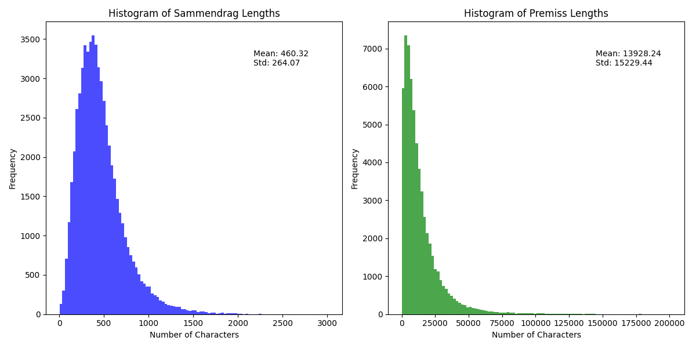
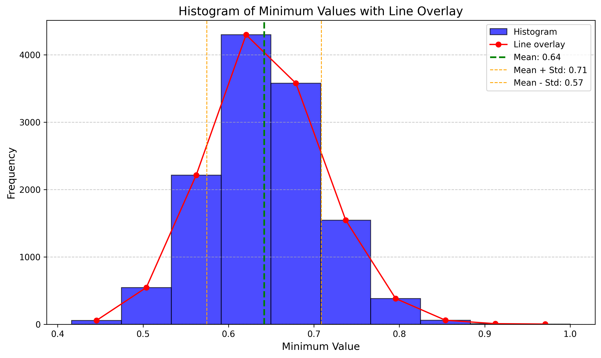

# LegSum

## Environment
- Run `pip install -r requirements.txt` to install the rest of the packages
- We use Python 3.9

## Folder Structure

- `configure`: the running configures for each dataset, such as number of stages, beam width etc.
- `dataset_loader`: the python scripts to convert original dataset to the uniform format.
- `models`: 
  - `data_segment`: including source and target segmentation code; Refer to `README.md` in the folder for more information
  - `gen_summary`: inference on the source text and generate coarse summaries;
  - `data_prunning`: train data similarity score prediction classifier and prun data.
- `utils`: utilities such as config parser & dataset reader etc.
-  `similarity`: calculate similarity between texts and summaries
- `run.py` the entrance of the code.

## Dataset
### Data Format
We got data from `Lovdata.no` with limited time usage. Data was prepared by `LovData.no` in the form of XML format. Below is an example where `[...]` is used to hide part of the data due to copyrighted materials.
```xml
<?xml version='1.0' encoding='utf-8'?>
<root>
<Disclaimer>Automatisk avidentifisert rettsavgjørelse med fiktivt saksnummer. Kun sammendrag og premiss/sluttning.</Disclaimer>
<Sammendrag> Anke over lagmannsrettens manglende kjennelse [...] Anken forkastet. (Sammendrag ved Lovdata.)
</Sammendrag>
<Premiss>
 (7) Høyesteretts ankeutvalg [...] en anke ankes på grunnlag av feil ved saksbehandlingen.
 (8) I Høyesteretts kjennelse [...] Anken blir etter dette forkastet.
 (9) Kjennelsen [...] enstemmig.
</Premiss>
<Slutning>
 Slutning:
 Anken forkastes.
</Slutning>
</root>
```
### Data Statistics and Splitting
- To get the statistics of data:
```python
source env/bin/activate
VERBOSE=True PYTHONPATH=$PYTHONPATH:$PWD python xml_data_statistics.py
```

- Due to many items of the dataset are either short or very short, we have to remove those. In file `xml_data_splitting.py` we set the threshold for cutting point using the number of characters in summary (`sammendrag`) and text (`premiss`):
```python
# Specify the directory containing the XML files
directory = "./data/all_lovdata"
output_directory = "./data"

# Define thresholds (number of characters required)
threshold_sammendrag = 200 # summary length
threshold_premiss = 12_000 # text length
```
- Filtering and splitting data into 70-10-20 (train/val/test folder) can be done using script below:
```python
source env/bin/activate
VERBOSE=True PYTHONPATH=$PYTHONPATH:$PWD python xml_data_splitting.py
# This will copy corresponding XML files into train/val/test folder
```

### Data Preprocessing
Each method requires different data format to run:

#### Baseline
Baseline fine-tuning method does not have structured data in `text` field, document text is a long sequence.

```JSON
{
  "train": [
    {
      "summary": "Saken gjelder krav om omstøtelse […] var grunnlag for omstøtelse og forkastet anken.",
      "filename": "lf-2017-110.xml",
      "text": [
          "Lagmannsrettens vurdering. B befant seg […] hans to sønner. Overdragelsene […] livsdisposisjoner. Spørsmålet om […] sted på dødsleiet"
          ]
    },
    {...}
    ],
  "val":[
    {
      […]
    }
  ],
  "test":[
    {
      […]
    }
  ]
}
```


#### SUMM\(^{N}\) method
- This method use non-structured data which means the JSON has 3 splits (train, val, test), each split contains document data (text, summary, filename). Text is a list of sentences.
```JSON
{
  "train": [
    {
      "summary": "Saken gjelder krav om omstøtelse […] var grunnlag for omstøtelse og forkastet anken.",
      "filename": "lf-2017-110.xml",
      "text": [
          "Lagmannsrettens vurdering",
          "B befant seg […] hans to sønner.",
          "Overdragelsene […] livsdisposisjoner.",
          "Spørsmålet om […] sted på dødsleiet",...,
          ]
    },
    {...}
    ],
  "val":[
    {
      […]
    }
  ],
  "test":[
    {
      […]
    }
  ]
}
```
#### Paragraph method (both `level`, `Rouge-1`, and `BertScore`)
- For paragraph level segment and paragraph level similarity segment we use the same structured data.
- We create dummy chapter (`KAPITTEL_0`) for each document, where each chapter has sub-chapter (`KAPITTEL_0_x`) which is determined by the line break in the XML document.
- Data in eacah sub-chapter is sentenization.
```JSON
{
  "train": [
    {
      "summary": "En 25 år gammel mann […] ubetinget fengsel i to år og en måned.",
      "filename": "hr-2002-123.xml",
      "text": {
        "KAPITTEL_0": {
            "KAPITTEL_0_0": [
                "Jeg er kommet […] forkastes.",
                "A er for […] følgende:"
            ],
            "KAPITTEL_0_1": [
                "Domfelte og […] samleiene."
            ],
            "KAPITTEL_0_2": [
                "Lagmannsrettens […] problemer.",
                "Jeg er enig med […] strategi.",
                "Ano8 har fremholdt at det […] medførte.",
                ...
            ]
        }
    }
    },
    {...}
    ],
  "val":[
    {
      […]
    }
  ],
  "test":[
    {
      […]
    }
  ]
}
```
#### Command to process XML data
The script below will go through `train/val/test` folder and pre-process the data.

```python
source env/bin/activate
# SUMM^N method
VERBOSE=True PYTHONPATH=$PYTHONPATH:$PWD python xml_data_preprocessing.py \
  --do_sentenization --output_file ./data/all_processed_data/all_data_wo_segment_w_sent.json

# Paragraph method
VERBOSE=True PYTHONPATH=$PYTHONPATH:$PWD python xml_data_preprocessing.py \
  --output_file ./data/all_processed_data/all_data_w_segment_w_sent.json --do_segmentation

# Baseline method
VERBOSE=True PYTHONPATH=$PYTHONPATH:$PWD python xml_data_preprocessing.py \
  --do_combined --output_file ./data/all_processed_data/all_data_wo_seg_wo_sent.json
```

### Data Pruning
Data pruning technique is used to prune the data to reduce the training time and remove irrelevant texts from the full text.
This can be done in the following steps:
1. Calculate weighted cosine similarity of between every sentence in the full text with every sentence in summary.
2. Calculate mean and standard deviation of the similarity scores in training set. This will be used as threshold for pruning the data.
3. Create a dataset of all sentences in training set as training data and their corresponding scores as labels. Train a classifier to predict the score of text using this dataset.
4. This classifier is used to predict similarity scores of each sentence in train/val/test set.
5. Pruning dataset by keeping all sentences above the threshold.

#### Similarity Matrix
To calculate the similarity matrix for all documents:

```python
source env/bin/activate
VERBOSE=True PYTHONPATH=$PYTHONPATH:$PWD python similarity/run_similarity.py
```

#### Compute Mean and Standard Deviation
```python
source env/bin/activate
VERBOSE=True PYTHONPATH=$PYTHONPATH:$PWD python similarity/analyze_sim_matrix.py
```
Below is the output of our data:


#### Create Dataset for Similarity Score Classifier
Output file is JSON format. Every sentence in document is compared to every sentence in full text. 
Matrix will be `|sum-sents| x |full-text-sents|`.
Per column, we pick highest score. Resulted dataset will have the size of: `|full-text-sents| * number-of-documents` in each split.

```python
output_file = f"{output_dir}similarity_{split}_dataset.json"
```

Each train/val/test split will have JSON output, eg. `similarity_train_dataset.json`.
```python
source env/bin/activate
VERBOSE=True PYTHONPATH=$PYTHONPATH:$PWD python similarity/classifier_dataparsing
```
Example data from classifier dataset.
```JSON
{"text": "sentence 1", "label": 0.625864492408552}
{"text": "sentence 2", "label": 0.40787725658338997}
```

#### Train Similarity Score Prediction Classifier
```python
source env/bin/activate

VERBOSE=True PYTHONPATH=$PYTHONPATH:$PWD python models/data_prunning/prunning_classifier.py \
    --train-data-path data/all_processed_data/similarity_train_dataset.json \
    --val-data-path data/all_processed_data/similarity_val_dataset.json \
    --test-data-path data/all_processed_data/similarity_test_dataset.json \
    --output-model-path ./output/ \
    --model NbAiLab/nb-bert-large \
    --learning-rate 3e-5 \
    --warmup 2_000 \
    --batch-size 64 \
    --max-length 512 \
    --epochs 3 \
    --weight-decay 0.01 \
    --do-training \
    --do-testing \
    --logging-steps 100 \
    --do-logging --run-name all_no_regression_classifier

```

#### Command to Prune Data
Important thing to setup before running:- `batch_size`: how many items to preprocess per batch
- `splits`: a list of names (don't change)
- `do_reformat`: `False` means using no structured format used for SUMM\(^{N}\) and `True` is used for paragraph methods with structured format.
- `keep_order`: `True` means keep the order of the text as in the document and `False` will shuffle the text.
- `proportion_values`: Proportion of data to keep. After predicting similarity score for each sentence in the text, keep `X proportion` of top scores.
- `threshold`: Remove all texts that are below this threshold for all documents in daataset. This is the `means` and `+-` `standard deviation`.
- `local threshold`: meaning calculating average similarity score per document and remove all texts that are below this threshold per document.
- `input_file`: We only use JSON without format for this task `all_data_wo_segment_w_sent.json`

```python
# File data_pruner.py

batch_size = 24
splits = ["train", "val", "test"]

do_reformat = [False, True]
keep_order = [True, False]

proportion_values = [0.7, 0.5, 0.3]
threshold_values = [0.57, 0.71, 0.64] # This is the means and +- standard deviation

input_file = "data/all_processed_data/all_data_wo_segment_w_sent.json"
classifier_path = "output/regression.cls.20241212/trainer_output/checkpoint-123"

# Pre-calculate similarity scores for all documents (train, val, test)
DataPruner(file_name=input_file, splits=splits, model_path=classifier_path).all_scores_process()

# Pruning Data
for order in keep_order:
    for reformat in do_reformat:
        # Proportion
        for proportion in proportion_values:
            if reformat:
                logger.info(f"ORDER: {order} Para method. Proportion {proportion}. Reformat {reformat}")
            else:
                logger.info(f"ORDER: {order} SUMM^N method. Proportion {proportion}. Reformat {reformat}")

            pruner = DataPruner(
                splits=splits, data_directory="data/all_processed_data",
                threshold=None, use_local_threshold=False,
                model_path=classifier_path,
                proportion=proportion,
                reformat=reformat,
                keep_order=order,
                batch_size=batch_size, 
                file_name=input_file
            )
            pruner.process_splits()
        
        # Local threshold
        logger.info(f"ORDER: {order} SUMM^N method. Threshold LOCAL. Reformat {reformat}")
        pruner = DataPruner(
            splits=splits, data_directory="data/all_processed_data",
            threshold=None, use_local_threshold=True,
            model_path=classifier_path,
            proportion=None,
            reformat=reformat,
            keep_order=order,
            batch_size=batch_size, 
            file_name=input_file
        )
        pruner.process_splits()
        
        # Threshold
        for threshold in threshold_values:
            if reformat:
                logger.info(f"ORDER: {order} Para method. Threshold {threshold}. Reformat {reformat}")
            else:
                logger.info(f"ORDER: {order} SUMM^N method. Threshold {threshold}. Reformat {reformat}")

            pruner = DataPruner(
            splits=splits, data_directory="data/all_processed_data",
                threshold=threshold, use_local_threshold=False,
                model_path=classifier_path,
                proportion=None,
                reformat=reformat,
                keep_order=order,
                batch_size=batch_size, 
                file_name=input_file
            )
            pruner.process_splits()
```

Run pruner:
```python
source env/bin/activate
VERBOSE=True PYTHONPATH=$PYTHONPATH:$PWD python models/data_pruning/data_prunner.py
```

## Training and Evaluation
We have different settings to train and evaluate models:
- Run on all data 
- Run on pruning data

Training is logged into `wandb`. Remmeber to login before running.

### Baseline model

To train baseline fine-tuned model, we have to format JSON data into 6 files (2 files per split). 
Each split has 2 files: `{split_name}.source` and `{split_name}.target` where each line in `source` is one training example with a long sequence of text and each line `target` is the corresponding summary text.
To process JSON file into this format, we use the following command:

```python
source env/bin/activate
cd models/data_segment

# No pruning data
VERBOSE=True PYTHONPATH=$PYTHONPATH:$PWD python classic_segment.py \
    --data_file="../data/all_processed_data/all_data_wo_seg_wo_sent.json" \
    --output_dir=../data/all_processed_data/classic_all_no_data

# With pruning data
VERBOSE=True PYTHONPATH=$PYTHONPATH:$PWD python classic_segment.py \
    --data_file="../data/processed_data/prunned_data/all_splits_threshold_0.64_reformat_false_order_true.json" \
    --output_dir=../data/processed_data/prunned_data/classic_threshold_0.64_reformat_false_order_true

```
#### Run training
`--input-data-path` is the path to the training data folder containing `train.source`, `train.target`, `val.source`, `val.target`, `test.source` and `test.target`.

```python
source env/bin/activate

# RUN ON ALL LOVDATA WITHOUT PRUNING
VERBOSE=True PYTHONPATH=$PYTHONPATH:$PWD python models/train_classic_summarizer.py \
  --model ltg/nort5-large \
  --input-data-path ./data/all_processed_data/classic_all_no_data \
  --learning-rate 2e-5 \
  --batch-size 8 \
  --epochs 2 \
  --do-logging \
  --do-training --do-validation --do-testing \
  --max-length 512 \
  --min-length 64 \
  --max-new-tokens 256 \
  --temperature 0.7 \
  --top-k 40 \
  --top-p 0.7 \
  --num-beams 8 \
  --no-repeat-ngram-size 3

# RUN ON PRUNING DATA, REPLACE dataset-path WITH CORRESPONDING FOLDER CONTAINING DATA
# AND CHANGE output-path NAME

VERBOSE=True PYTHONPATH=$PYTHONPATH:$PWD python models/train_classic_summarizer.py \
  --model ltg/nort5-large \
  --input-data-path ./data/processed_data/prunned_data/classic_proportion_0.3_reformat_false_order_true \
  --learning-rate 2e-5 \
  --batch-size 8 \
  --epochs 2 \
  --do-logging \
  --do-training --do-validation --do-testing \
  --max-length 512 \
  --min-length 64 \
  --max-new-tokens 256 \
  --temperature 0.7 \
  --top-k 40 \
  --top-p 0.7 \
  --num-beams 8 \
  --no-repeat-ngram-size 3
```
### Configurations
Configurations are used for SUMM$^N$ method and paragraph methods. We have 2 configurations files:
- `run_config.cfg`
  - `input_max_token`: max number of tokens accepted by T5 model
  - `reuse_stage1`: For every method we will do data segmentation, this will be saved into cache. In case we have to run this again, we can reload this cache to save time. Set value to `True` for this feature.
- `/configure/LOV.cfg`
  - `stage_num = 2`: How many stages we want to use. At the moment, we use 2 stages.
  - `fine_grained`: Set to `False` for first stage and to `True` for final stage which generates final summary. This is reused from SUMM\(^{N}\) method.
  - `fine_tune_epochs`: number of fine-tuned epoch.

```bash
# run_config.cfg
[DEFAULT]
data_check = StructureCheck
target_segmentor = TargetSegmentor
summary_generator = SummaryGenerator
coarse_seg_combiner = CoarseSegCombiner

[summ.n.BRICKS]
data_check = NoStructureCheck
source_segmentor = SourceSegmentor

[paragraph.level.BRICKS]
source_segmentor = MultiStructureSourceSegmentor

[paragraph.rouge.BRICKS]
source_segmentor = RougeSourceSimilaritySegmentor
input_max_token = 512
reuse_stage1 = True

[paragraph.bert.BRICKS]
source_segmentor = BertSourceSimilaritySegmentor
input_max_token = 512
reuse_stage1 = True

```
### SUMM\(^{N}\) model

```python
source env/bin/activate

# RUN ON ALL LOVDATA WITHOUT PRUNING
VERBOSE=True PYTHONPATH=$PYTHONPATH:$PWD python run.py \
  --cfg LOV.cfg \
  --dataset-path ./data/all_processed_data/all_data_wo_segment_w_sent.json \
  --run summ.n \
  --output-path ./output/LOV.summ.n.noprun \
  --mode train \
  --base-model ltg/nort5-large \
  --wandb-mode online \
  --learning-rate 2e-5 \
  --batch-size 8 \
  --save-total-limit 1 \
  --logging-steps 100 \
  --max-length 512 \
  --min-length 64 \
  --max-new-tokens 256 \
  --temperature 0.7 \
  --top-k 40 \
  --top-p 0.7 \
  --num-beams 8 \
  --no-repeat-ngram-size 3

# RUN ON PRUNING DATA, REPLACE dataset-path WITH CORRESPONDING FILENAME
# AND CHANGE output-path NAME

VERBOSE=True PYTHONPATH=$PYTHONPATH:$PWD python run.py \
  --cfg LOV.cfg \
  --dataset-path ./data/processed_data/prunned_data/all_splits_threshold_0.62_reformat_false_order_false.json \
  --run summ.n \
  --output-path ./output/LOV.summ.n.t.62 \
  --mode train \
  --base-model ltg/nort5-large \
  --wandb-mode online \
  --learning-rate 2e-5 \
  --batch-size 8 \
  --save-total-limit 1 \
  --logging-steps 10 \
  --max-length 512 \
  --min-length 64 \
  --max-new-tokens 256 \
  --temperature 0.7 \
  --top-k 40 \
  --top-p 0.7 \
  --num-beams 8 \
  --no-repeat-ngram-size 3
```
### Paragraph Level Segmentation
```python
source env/bin/activate

# RUN ON ALL LOVDATA WITHOUT PRUNING
VERBOSE=True PYTHONPATH=$PYTHONPATH:$PWD python run.py \
  --cfg LOV.cfg \
  --dataset-path ./data/all_processed_data/all_data_w_segment_w_sent.json \
  --run paragraph.level\
  --output-path ./output/LOV.paragraph.level.noprun \
  --mode train \
  --base-model ltg/nort5-large \
  --wandb-mode online \
  --learning-rate 2e-5 \
  --batch-size 8 \
  --save-total-limit 1 \
  --logging-steps 100 \
  --max-length 512 \
  --min-length 64 \
  --max-new-tokens 256 \
  --temperature 0.7 \
  --top-k 40 \
  --top-p 0.7 \
  --num-beams 8 \
  --no-repeat-ngram-size 3

# RUN ON PRUNING DATA, REPLACE dataset-path WITH CORRESPONDING FILENAME
# AND CHANGE output-path NAME
VERBOSE=True PYTHONPATH=$PYTHONPATH:$PWD python run.py \
  --cfg LOV.cfg \
  --dataset-path ./data/all_processed_data/prunned_data/all_splits_threshold_0.64_reformat_true_order_true.json \
  --run paragraph.level\
  --output-path ./output/LOV.paragraph.level.t.64 \
  --mode train \
  --base-model ltg/nort5-large \
  --wandb-mode online \
  --learning-rate 2e-5 \
  --batch-size 8 \
  --save-total-limit 1 \
  --logging-steps 100 \
  --max-length 512 \
  --min-length 64 \
  --max-new-tokens 256 \
  --temperature 0.7 \
  --top-k 40 \
  --top-p 0.7 \
  --num-beams 8 \
  --no-repeat-ngram-size 3
```

#### Paragraph Level Similarity using `ROUGE-1` metric
```python
source env/bin/activate

# RUN ON ALL LOVDATA WITHOUT PRUNING
VERBOSE=True PYTHONPATH=$PYTHONPATH:$PWD python run.py \
  --cfg LOV.cfg \
  --dataset-path ./data/all_processed_data/all_data_w_segment_w_sent.json \
  --run paragraph.rouge \
  --output-path ./output/LOV.paragraph.rouge.noprun \
  --mode train \
  --base-model ltg/nort5-large \
  --wandb-mode online \
  --learning-rate 2e-5 \
  --batch-size 8 \
  --save-total-limit 1 \
  --logging-steps 100 \
  --max-length 512 \
  --min-length 64 \
  --max-new-tokens 256 \
  --temperature 0.7 \
  --top-k 40 \
  --top-p 0.7 \
  --num-beams 8 \
  --no-repeat-ngram-size 3

# RUN ON PRUNING DATA, REPLACE dataset-path WITH CORRESPONDING FILENAME
# AND CHANGE output-path NAME
VERBOSE=True PYTHONPATH=$PYTHONPATH:$PWD python run.py \
  --cfg LOV.cfg \
  --dataset-path ./data/all_processed_data/prunned_data/all_splits_threshold_0.64_reformat_true_order_true.json \
  --run paragraph.rouge \
  --output-path ./output/LOV.paragraph.rouge.t.64 \
  --mode train \
  --base-model ltg/nort5-large \
  --wandb-mode online \
  --learning-rate 2e-5 \
  --batch-size 8 \
  --save-total-limit 1 \
  --logging-steps 100 \
  --max-length 512 \
  --min-length 64 \
  --max-new-tokens 256 \
  --temperature 0.7 \
  --top-k 40 \
  --top-p 0.7 \
  --num-beams 8 \
  --no-repeat-ngram-size 3

```
#### Paragraph Level Similarity using `BERTScore` metric
```python
source env/bin/activate

# RUN ON ALL LOVDATA WITHOUT PRUNING
VERBOSE=True PYTHONPATH=$PYTHONPATH:$PWD python run.py \
  --cfg LOV.cfg \
  --dataset-path ./data/all_processed_data/all_data_w_segment_w_sent.json \
  --run paragraph.bert\
  --output-path ./output/LOV.paragraph.bert.noprun \
  --mode train \
  --base-model ltg/nort5-large \
  --wandb-mode online \
  --learning-rate 2e-5 \
  --batch-size 8 \
  --save-total-limit 1 \
  --logging-steps 100 \
  --max-length 512 \
  --min-length 64 \
  --max-new-tokens 256 \
  --temperature 0.7 \
  --top-k 40 \
  --top-p 0.7 \
  --num-beams 8 \
  --no-repeat-ngram-size 3

# RUN ON PRUNING DATA, REPLACE dataset-path WITH CORRESPONDING FILENAME
# AND CHANGE output-path NAME
VERBOSE=True PYTHONPATH=$PYTHONPATH:$PWD python run.py \
  --cfg LOV.cfg \
  --dataset-path ./data/processed_data/prunned_data/all_splits_threshold_local_reformat_true_order_false.json \
  --run paragraph.bert\
  --output-path ./output/LOV.paragraph.bert.local.t \
  --mode train \
  --base-model ltg/nort5-large \
  --wandb-mode online \
  --learning-rate 2e-5 \
  --batch-size 8 \
  --save-total-limit 1 \
  --logging-steps 10 \
  --max-length 512 \
  --min-length 64 \
  --max-new-tokens 256 \
  --temperature 0.7 \
  --top-k 40 \
  --top-p 0.7 \
  --num-beams 8 \
  --no-repeat-ngram-size 3
```

## Exemplary Summaries
Table below shows some generated summaries by different methods for threshold *0.57* and *without shuffling* for LovData .

- The generated summaries show that most models successfully capture the core elements of the ground-truth summary, particularly regarding the charges, sentencing, and compensation awarded. 
- Classic Fine-tune provides the most comprehensive and accurate summary, including not only all key facts but also valuable legal context such as sentence reduction reasons.
- SUMM\(^{N}\) performs similarly but omits the rationale behind sentence reductions.
- Paragraph ROUGE and Paragraph Level introduce inaccuracies, particularly by misrepresenting the compensation verdict, with - Paragraph Level also failing to mention the sentence reduction.
- Paragraph BERT effectively captures the key details, although it redundantly mentions compensation.
Overall, fine-tuned models outperform structured approaches in both completeness and factual accuracy, emphasizing the importance of contextual understanding in summarizing legal documents.

# Anonymized LovData — Example Summaries generated by different methods for threshold 0.57 and *without shuffling*

| **Method**             | **Summary**                                                                                                                                                                                                                                                                                                                                                           |
|------------------------|-----------------------------------------------------------------------------------------------------------------------------------------------------------------------------------------------------------------------------------------------------------------------------------------------------------------------------------------------------------------------|
| **Ground-truth**       | En 44 år gammel mann dømt for voldtekt, frihetsberøvelse, kroppsskade og trusler mot sin tidligere kjæreste. Handlingene hadde skjedd i løpet av en kveld og en natt i tiltaltes leilighet. Straffen ble i utgangspunktet satt til fengsel i fire år og tre måneder, men redusert til tre år og ni måneder på grunn av tidsbruken. Fornærmede ble tilkjent oppreisning med **240000 kroner**. <br> <sup>*A 44-year-old man was convicted of rape, deprivation of liberty, bodily harm, and threats against his former girlfriend. The acts took place over an evening and a night in the defendant's apartment. The sentence was initially set at four years and three months in prison but reduced to three years and nine months due to the time taken. The victim was awarded compensation of **240,000 NOK**.*</sup> |
| **Classic Fine-tune**  | En mann ble dømt til **_fengsel i 3 år og 9 måneder_** for voldtekt til seksuell omgang, kroppsskade, trusler og frihetsberøvelse. Han ble også dømt til å betale oppreisningserstatning til fornærmede **_med 240000 kroner_**. (Sammendrag ved Lovdata.) Lagmannsrettens flertall kom til at tiltalte var skyldig i voldtekt, men at det skulle utmåles straff for både kroppsskaden, truslene og frihetsberøvelsen i tillegg til voldtekten. Det ble tatt utgangspunkt i et straffenivå på fengsel i 4 år og 3 måneder. Etter fradrag for tilståelse og lang saksbehandlingstid ble straffen utmålt til 3 år 9 måneder. <br> <sup>*A man was sentenced to **3 years and 9 months in prison** for rape, bodily harm, threats, and deprivation of liberty. He was also ordered to pay the victim compensation of **240,000 NOK**. (Summary by Lovdata.) The Court of Appeal found the defendant guilty of rape and imposed penalties for the bodily harm, threats, and deprivation of liberty. The initial sentence was set at four years and three months but was reduced due to confession and lengthy case processing.*</sup> |
| **SUMM\(^{N}\)**       | En mann ble dømt til **_fengsel i 3 år og 9 måneder_** for voldtekt til seksuell omgang, kroppsskade, trusler og frihetsberøvelse. Han ble også dømt til å betale oppreisningserstatning til fornærmede med **_240000 kroner_**. (Sammendrag ved Lovdata.) Lagmannsrettens flertall kom til at det skulle tas utgangspunkt i et straffenivå på fengsel i 4 år og 3 måneder. <br> <sup>*A man was sentenced to **3 years and 9 months in prison** for rape, bodily harm, threats, and deprivation of liberty. He was also ordered to pay compensation to the victim of **240,000 NOK**. (Summary by Lovdata.) The Court of Appeal based the sentence on an initial term of four years and three months.*</sup> |
| **Paragraph Level**    | En mann ble dømt til fengsel i 4 år og 3 måneder for voldtekt, kroppsskade, trusler og frihetsberøvelse. Han ble også dømt til å betale oppreisningserstatning til **_fornærmede med 240000 kroner_**. (Sammendrag ved Lovdata.) Tiltalte ble frifunnet for krav om oppreisningserstatning fra fornærmede. Dissens 6-1. <br> <sup>*A man was sentenced to four years and three months in prison for rape, bodily harm, threats, and deprivation of liberty. He was also ordered to pay the victim compensation of **240,000 NOK**. (Summary by Lovdata.) The defendant was acquitted of a separate claim for compensation. The verdict was decided with a 6-1 dissent.*</sup> |
| **Paragraph ROUGE**    | En mann ble dømt til **_fengsel i 3 år og 9 måneder_** for voldtekt til seksuell omgang, kroppsskade, trusler og frihetsberøvelse. Han ble også dømt til å betale oppreisningserstatning til fornærmede **_med 240000 kroner_**. (Sammendrag ved Lovdata.) Tiltalte ble frifunnet for krav om oppreisningserstatning. <br> <sup>*A man was sentenced to **3 years and 9 months in prison** for rape, bodily harm, threats, and deprivation of liberty. He was also ordered to pay compensation to the victim of **240,000 NOK**. (Summary by Lovdata.) The defendant was acquitted of a separate compensation claim.*</sup> |
| **Paragraph BERT**     | Lagmannsretten fant tiltalte skyldig i voldtekt til seksuell omgang, kroppsskade, trusler og frihetsberøvelse. Tiltalte ble dømt til **_fengsel i 3 år og 9 måneder_**. Fornærmede ble tilkjent oppreisningserstatning **_med 240000 kroner_**. (Sammendrag ved Lovdata.) Tiltalte ble også dømt til å betale oppreisningserstatning til fornærmede. <br> <sup>*The Court of Appeal found the defendant guilty of rape, bodily harm, threats, and deprivation of liberty. The defendant was sentenced to **3 years and 9 months in prison**. The victim was awarded compensation of **240,000 NOK**. (Summary by Lovdata.) The defendant was also ordered to pay the compensation to the victim.*</sup> |
